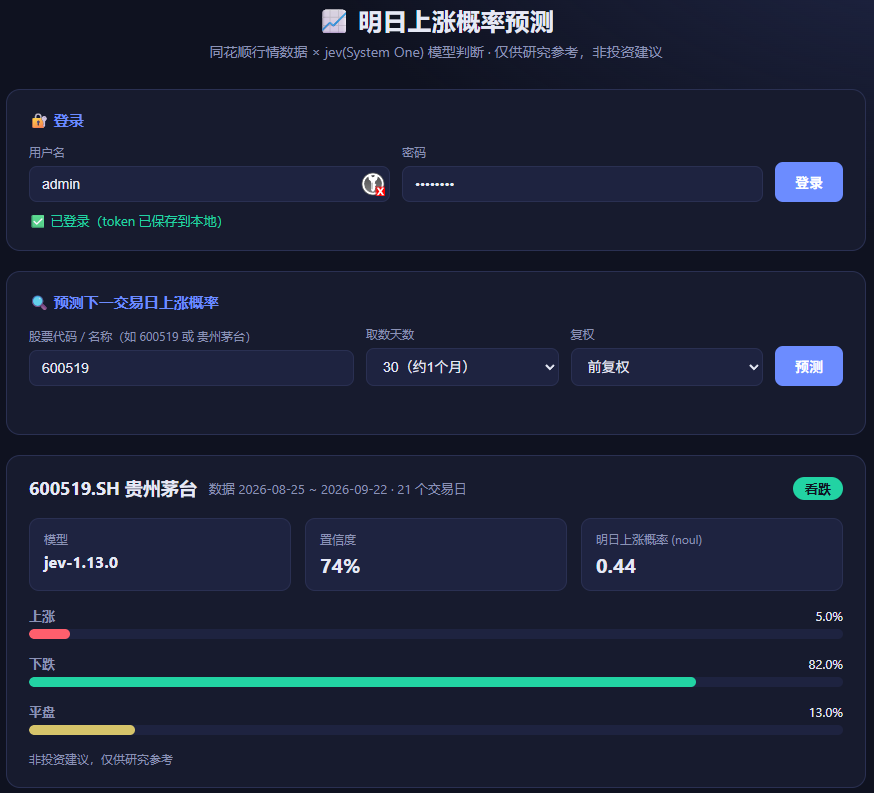
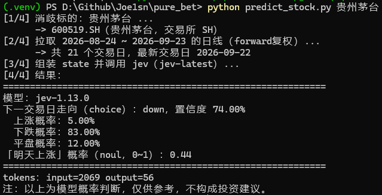

# 股票明日上涨概率预测 + FastAPI Web 服务

**仅供研究参考，非投资建议，实测不准确概率高**

根据某只 A 股**过去一个月（约 20 个交易日）的每日涨跌**，用 [jev（TypeSafe System One 模型）](https://docs.typesafe.ai/) 判断**明天上涨的概率**。

数据来自[同花顺金融数据服务](https://fuyao.aicubes.cn/)，模型判断来自 jev。包含两套入口：

- **CLI 脚本** `predict_stock.py` —— 命令行一键预测
- **FastAPI Web 服务** `webapp/` —— JWT Bearer 认证，受保护的 `/predict` 接口



> ⚠️ 本项目输出仅为模型概率判断，**不构成投资建议**。

---

## 项目结构

```
.
├── predict_stock.py          # CLI：同花顺取数 + jev 判断（核心逻辑，被 Web 复用）
├── webapp/
│   ├── main.py               # FastAPI 入口，/ 与 /health
│   ├── config.py             # 配置（JWT secret、账号），从 .env 读取
│   ├── auth.py               # PBKDF2 密码哈希 + JWT 签发/校验 + Bearer 依赖
│   └── predict.py            # 受保护的 /predict 接口
├── requirements.txt          # Web 服务依赖
├── .env                      # API Key 等凭据（已 gitignore，勿提交）
└── README.md
```

## 依赖与安装

CLI 脚本 **仅用 Python 标准库**，零依赖。Web 服务需要 FastAPI 相关包。

```bash
git clone https://github.com/Joe1sn/pure_bet
cd ./pure_bet
# 创建并激活虚拟环境（可选但推荐）
python -m venv .venv

# windows:
.venv/Scripts/activate 
# Linux:
source .venv/bin/activate

# 安装 Web 服务依赖
pip install -r requirements.txt
```

## 配置（.env）

复制 `Financial-API/.env.example` 思路，在项目根建 `.env`（已 gitignore，不会进仓库，需要用户自行创建）：

```ini
# jev / TypeSafe 模型 Key
# 在 https://console.typesafe.ai/ 申请
TYPESAFE_API_KEY=apikey_xxxx

# 同花顺金融数据服务 Key
# 在 https://fuyao.aicubes.cn/ 申请
HITHINK_FINANCE_API_KEY=sk-fuyao-xxxx

# ---- Web 服务可选配置 ----
JWT_SECRET=请改成随机长字符串
JWT_EXPIRE_MINUTES=60
APP_USERNAME=admin
# 建议修改默认密码
APP_PASSWORD=admin123 
```

> 生产环境务必覆盖 `JWT_SECRET` 与默认账号密码；凭据只从环境变量或 `.env` 读取，**不写进代码**。

---

## 用法一：CLI

```bash
python predict_stock.py 600519.SH      # 按代码
python predict_stock.py 贵州茅台       # 按名称
python predict_stock.py 600519 --days 60 --adjust forward
```

输出示例：

```
模型：jev-1.13.0
下一交易日走向（choice）：down，置信度 73.00%
  上涨概率：6.00%  下跌概率：82.00%  平盘概率：12.00%
「明天上涨」概率（noul，0~1）：0.41
```



> 参数：`--days` 取数天数（默认 30），`--adjust` 复权方式（`none|forward|backward`，默认 forward）。

---

## 用法二：FastAPI Web 服务（网页版服务）


### 启动

```bash
.venv/Scripts/python -m uvicorn webapp.main:app --reload --port 8000
```

- Swagger 文档：<http://127.0.0.1:8000/docs>（可直接在界面点 Authorize 后测试）

### 接口一览

| 方法 | 路径 | 鉴权 | 说明 |
|---|---|---|---|
| GET | `/health` | 公开 | 存活检查 |
| POST | `/auth/login` | 公开 | `{username, password}` → `access_token` |
| GET | `/auth/me` | Bearer | 返回当前用户 |
| GET | `/predict?q=600519&days=30` | Bearer | 明日上涨概率 |

### 认证流程

```bash
# 1. 登录拿 token
TOKEN=$(curl -s -X POST http://127.0.0.1:8000/auth/login \
  -H "Content-Type: application/json" \
  -d '{"username":"admin","password":"admin123"}' | jq -r .access_token)

# 2. 带 token 调受保护接口
curl -s "http://127.0.0.1:8000/predict?q=600519&days=30" \
  -H "Authorization: Bearer $TOKEN"
```

无 token 或 token 无效一律返回 `401`。

### /predict 响应示例

```json
{
  "symbol": "600519.SH",
  "name": "贵州茅台",
  "data_window": { "start": "2026-08-24", "end": "2026-09-21", "trading_days": 21 },
  "model": "jev-1.13.0",
  "direction": "down",
  "confidence": 0.75,
  "probabilities": { "up": 0.05, "down": 0.84, "flat": 0.11 },
  "rise_prob_noul": 0.41,
  "usage": { "input_tokens": 2069, "output_tokens": 56 },
  "disclaimer": "非投资建议，仅供研究参考"
}
```

---

## 工作原理

1. **消歧**：`/api/meta/tickers/search` 把代码/名称转成唯一 `thscode`。
2. **取数**：`/api/a-share/prices/historical` 拉过去 N 天的日线（前复权）。
3. **组装 state**：把每日 日期/收盘/涨跌幅/开高低/成交量 + 区间统计拼成文本。
4. **模型判断**：`POST https://api.typesafe.ai/v1/systemone`（模型 `jev-latest`）并行问两类问题：
   - `choice`（up/down/flat）→ 每个方向概率 + 置信度
   - `noul` → 「明天上涨」的 0~1 概率

> 注：两类问题的结果有时不一致（如 choice 给 6% 上涨、noul 给 0.41），建议以带明确判据的 `choice` 为准，并把低置信度样本单列为人工复核。

## 常见问题

- **命令行 curl 传中文名 404？** Windows 的 curl 会用 GBK 编码。请用浏览器、Python `requests`/`httpx`，或显式 UTF-8 百分号编码（如 `q=%E8%B4%B5%E5%B7%9E%E8%8C%85%E5%8F%B0`）。
- **缺 Key？** 先确认根目录 `.env` 已填好两个 API Key。

## 安全说明

- API Key 与 JWT 密钥只经 `.env` / 环境变量注入，不写入代码或提交到 Git。
- 当前账号为进程内内存用户表（PBKDF2 加盐哈希），适合学习/内部使用；多用户生产场景建议接入数据库与更完整的密码策略。

## License	

见 [Financial-API/LICENSE](Financial-API/LICENSE)（MIT）。
